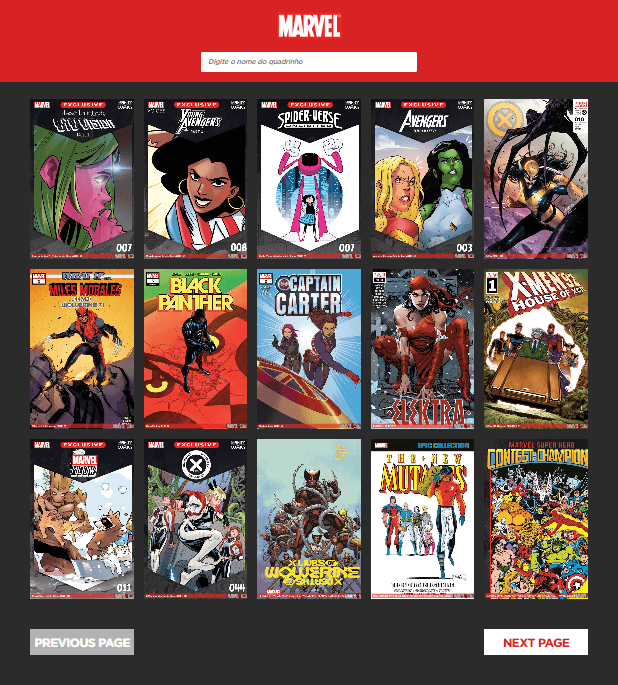

# Paginação de Revistas em Quadrinhos da Marvel
> Sistema web desenvolvido em [React.js](https://pt-br.reactjs.org/) com integração da [API da Marvel](https://developer.marvel.com/account) para o processo seletivo na Cloudinfo.

<p align="center">
  
  
</p>

## Dependências
> [Node.js](https://nodejs.org/) para a instação das dependências;

> [React.js](https://pt-br.reactjs.org/docs/getting-started.html) para a execução da aplicação;

## Execução do Projeto
1. Clonagem do projeto ```git clone```;
2. Abra a pasta do projeto com o prompt de comando e execute o comando ```npm install```;
3. Abra a subpasta do projeto ```./services/```, altere o arquivo ```key copy.ts``` para ```key.ts```.
4. Abra o arquivo ```key.ts``` com um editor de código e preencha as constantes ```publicKey``` e ```privateKey``` fornecidos por sua conta na [API da Marvel](https://developer.marvel.com/account);
5. Abra o prompt na pasta raiz do projeto e execute o comando ```npm start```;
<br>Bingo! :rocket:

## Observações
> 1 - Foi solicitada a listagem de Todas as Capas Lançadas Pela Marvel, porém a própria API limita a quantidade em 100;

> 2 - Foi solicitada que a listagem fosse da mais recente à mais antiga, porém a API está com alguns dados com datas bugadas, como por exemplo ``-01/01/0001`` dificuldade a identificação e ordenação das datas. A ordem foi pela ``Data de Modificação da Criação``, visto que era o parâmetro com menos dados com problemas;

> 3 - Foi solicitada o controle de dados atráves do ``Redux``, mas devido a simplicidade do projeto, foi utilizado o ``UserContext`` que é bem similar ao Redux e possui proposta similares. Foi utilizado o UserContext principalmente para favoritar quadrinhos específicos.;

## Implementações Adicionais
> 1 - Animações em todas as interações;

> 2 - Loading no processo de carregamento dos Quadrinhos;

> 3 - Input e Botões não ficam disponíveis com o Processo de Carregamento;

> 5 - Quando não encontra nenhum quadrinho, mostra uma mensagem de 'Not Found';

> 6 - Segurança nas Keys de acesso a API;

> 7 - Responsividade


